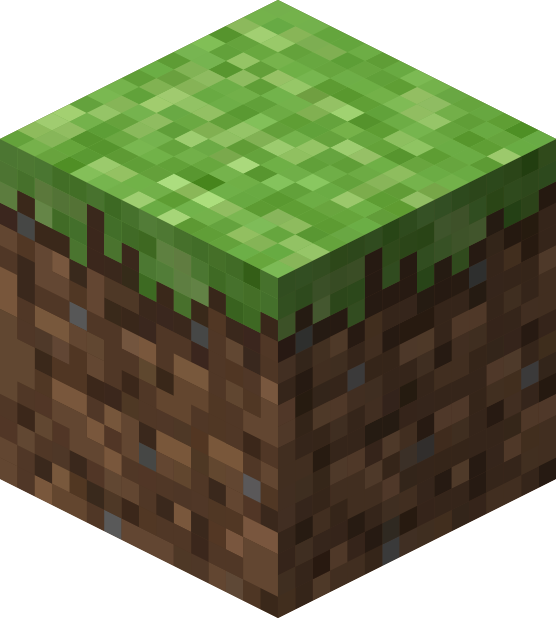
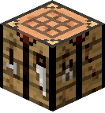
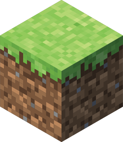
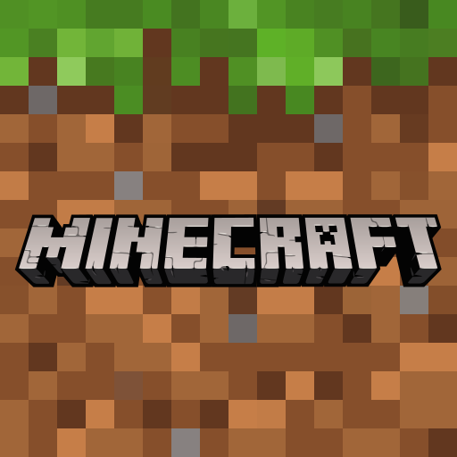
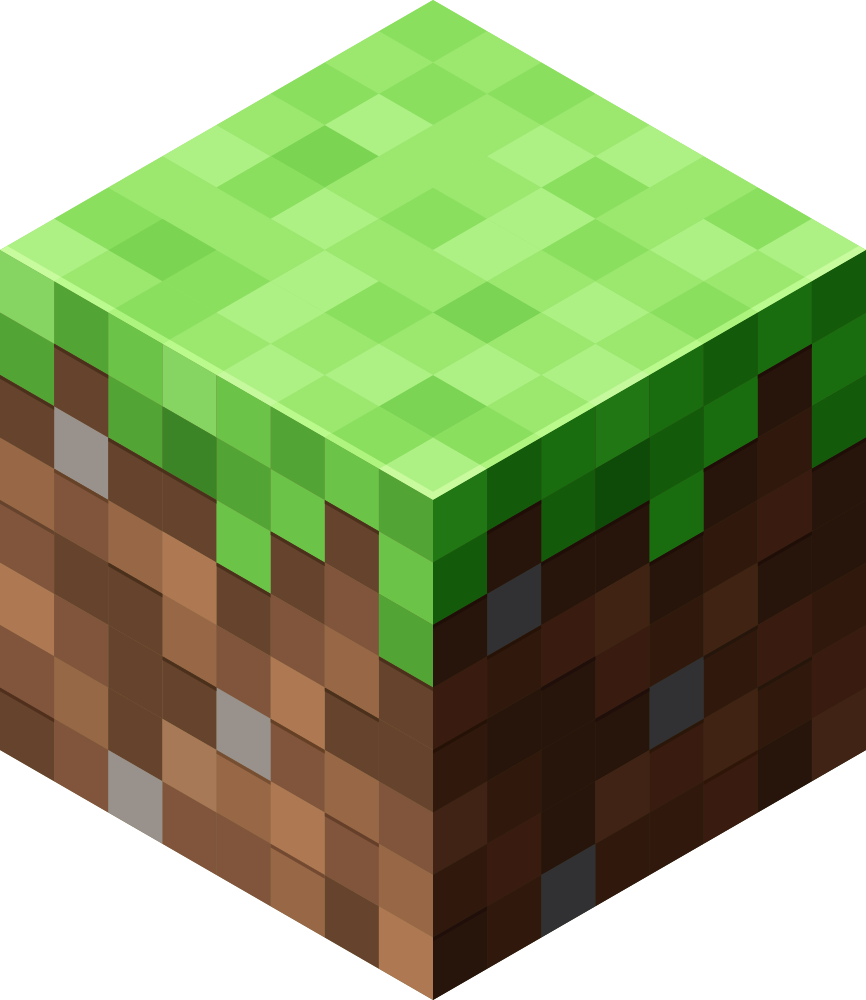
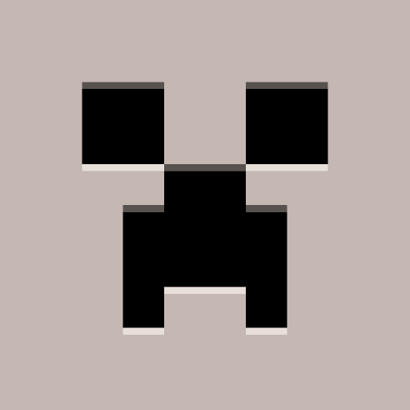

# UbuntuMinecraftUserInstaller

<div align="center">

[](https://www.minecraft.net/en-us/download "Link to the official Microsoft Minecraft download page")
[](https://ubuntu.com/ "Link to Ubuntu")


</div>

This script can be used to install and uninstall Minecraft on Ubuntu (tested on 25.04).
The standard executable file from Microsoft is used to start the program.
The script takes care of creating the necessary shortcuts.
The installer can be run as a normal user; 'sudo' is not necessary for
execution and is also not permitted. Without parameters, the script is
executed in interactive mode. Parameters can be entered for automation,
eliminating the need for inputs during installation.

## Parameter

```bash
install.sh [-v|--verbose] [--install | --uninstall] [--archive <path>] [--image <index>] [-h|--help] [--version]
```

| Parameter                         | Description                                      |
| :-------------------------------- | :----------------------------------------------- |
| -v, <nobr>--verbose       </nobr> | Enable verbose output                            |
| -h, <nobr>--help          </nobr> | Show this help message and exit                  |
|     <nobr>--install       </nobr> | Install the application                          |
|     <nobr>--uninstall     </nobr> | Uninstall the application                        |
|     <nobr>--archive       </path> | Specify the archive file path. If an archive is downloaded manually and specified here, this file is used and a later download is skipped |
|     <nobr>--image <index> </nobr> | Select an image index, from 0 to 10              |
|     <nobr>--version       </nobr> | Show the application version (from git) and exit |

### Desktop Icons

The desktop icon can be one of the following icons:

<picture>
  
</picture><picture>
  
</picture><picture>
  
</picture><picture>
  
</picture><picture>
  
</picture><picture>
  
</picture><picture>
  
</picture><picture>
  
</picture><picture>
  
</picture><picture>
  
</picture><picture>
  
</picture>
